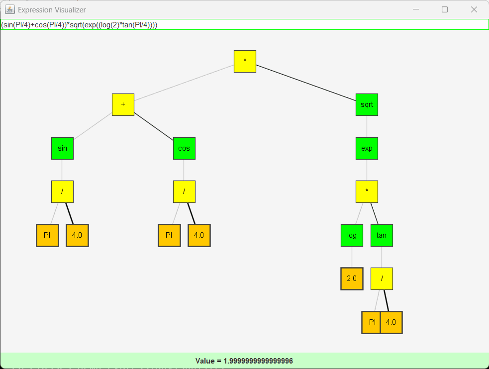
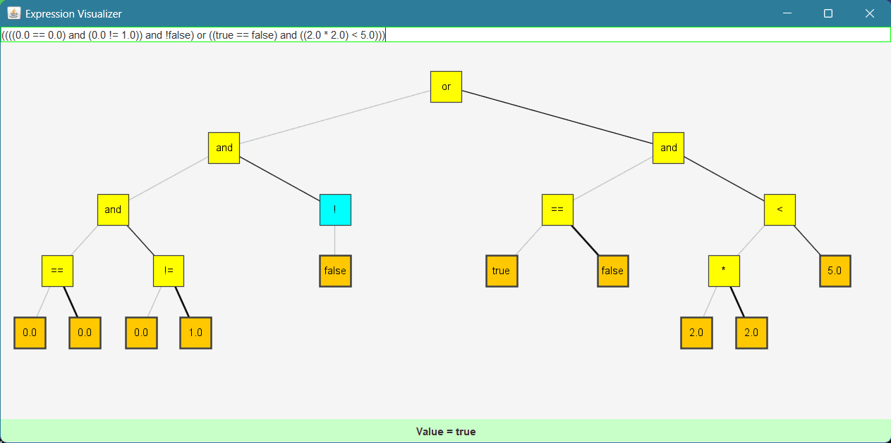

# Expression Parser
The class ExpressionParser implements expression parser. It supports parsing of expressions with numbers and booleans values.

Numeric expressions may contain brackets ( ), operators *,-,/,+,"and" and "or" and numbers with optional decimal point and values "true" and "false".
In addition it is possible to use constants "PI" and "E", functions sin(), cos(), tan(), log(), exp(), sqrt().
The parser supports common relation operators like ==,!=, >,<, >= and <= and even conditional expressions like condition ? true : false

User can register own functions and use them with Expression Parser

# Methods
The following methods are provided to parse and evaluate math expressions:
```
parseExpression(String expr): parses the given expression and returns a binary tree representing the parse expression;

evaluate(Node p): evaluates the binary tree containing an expression;

visit(Node p): visits the binary tree containing an expression;

registerFunction(String name, Function<Double, Double> logic): register user function with name and lambda logic
```

# TestSuite
The TestSuite performs positive and negative tests. Compile TestSuite to test package math:
```
ant compile
```
Run test suite:
```
java -cp classes test.TestSuite
```
# Demo
The demo allows to enter an expression in the top part, see the graph of the the expression tree in the center part and view the result of the math expression or syntax error in the bottom part.

Run demo:
```
java -cp classes demo.ExpressionVisualizer
```

# Syntax Rules
The parser use the following rules to parse math expressions:
```
<expression> ::= <conditional or expr> [ "?" <expression> ":" <expression> ]
<conditional or expr> ::= <boolean term> { "or" <boolean term> }*
<boolean term> ::= <equality relation> { "and" <equality relation> }*
<equality relation> ::= <relation expression> "==" <relation expression> | <relation expression> "!=" <relation expression> | <relation expression>
<relation expression> ::= <simple expression> "<" <simple expression> | <simple expression> "<=" <simple expression> | <simple expression> ">=" <simple expression> | <simple expression> ">" <simple expression>
<simple expression> ::= <term> { ("+"|"-") <term> }*
<term> ::= <factor> { ("*"|"/") <factor> }*
<factor> ::= <boolean> | <constant> | <unary function> "(" <expression> ")" | "(" <expression> ")" | "!" <factor> | "-" <factor> | <number>
<boolean> ::= "false" | "true"
<constant> == "PI" | "E"
<unary function> == "sin" | "cos" | "tan" | "log" | "exp" | "sqrt"
<number> ::= { <digit> }+ [ "." { <digit> }* ]
<digit> ::= "0" | "1" | "2" | "3" | "4" | "5" | "6" | "7" | "8" | "9"
```

# Example

Parsing the expression (sin(PI/4)+cos(PI/4))*sqrt(exp((log(2)*tan(PI/4)))) will generate the following binary tree:



Parsing the expression (0 == 0) and (0 != 1) and !false or ((true == false) and (2*2 < 5)) will generate the following binary tree:



